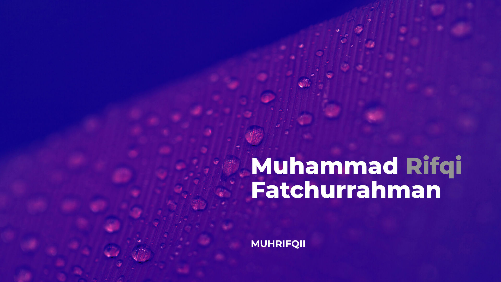

  <h1>
    A committed and detail-oriented software engineer
  </h1>
  

    Committed and detail-oriented software engineer with demonstrated skill with more than 7 years of experience both technical and managerial in product development. The percentage between technical and managerial is 70:30.    
  

  

    I have wide coverage of technology for multiple stacks. My experience started with native mobile dev for 5 years using Java, Kotlin, and Swift language. Continued with more than 4 years of experience in Fullstack Development, using Spring Boot Java as the backend, and using both react and angular as the frontend, all running on Google Cloud Platform.
  

  

 
 

<picture>
  <!-- <source
    srcset="https://github-readme-stats.vercel.app/api?username=muhrifqii&show_icons=true&theme=dark"
    media="(prefers-color-scheme: dark)"
  /> -->
  <!-- <source
    srcset="https://github-readme-stats.vercel.app/api?username=muhrifqii&show_icons=true"
    media="(prefers-color-scheme: light), (prefers-color-scheme: no-preference)"
  /> -->
  
</picture>
&nbsp;&nbsp;
<picture>
  
</picture>

